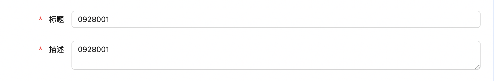
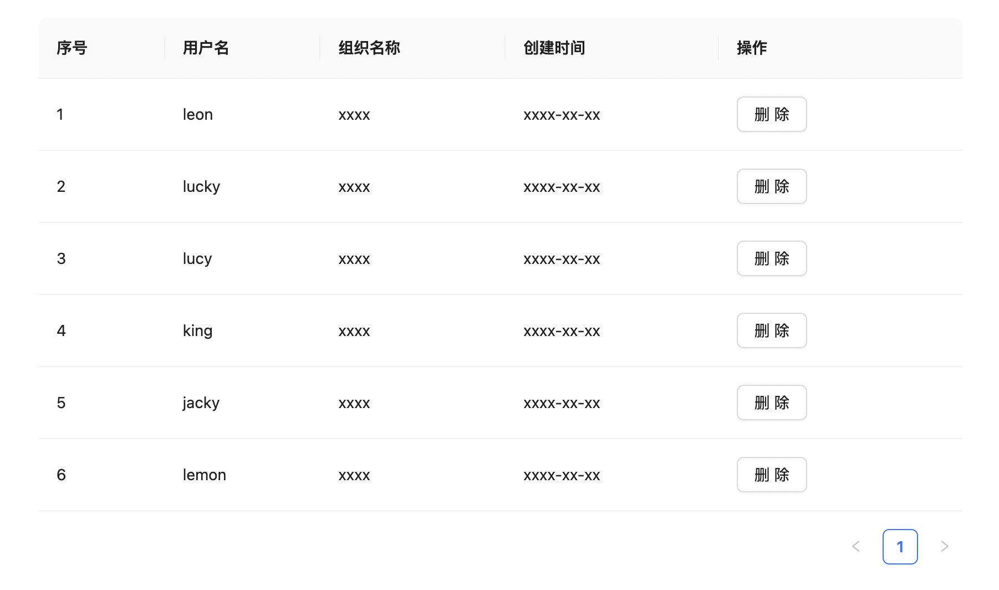
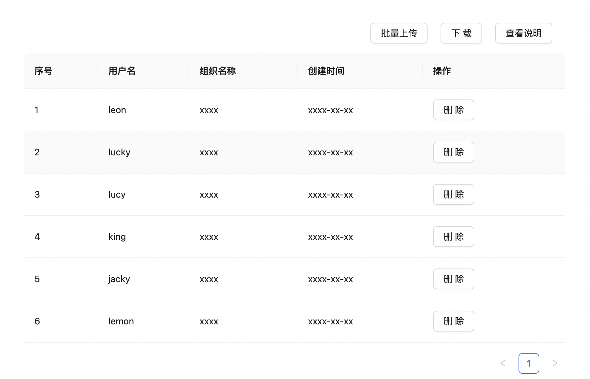
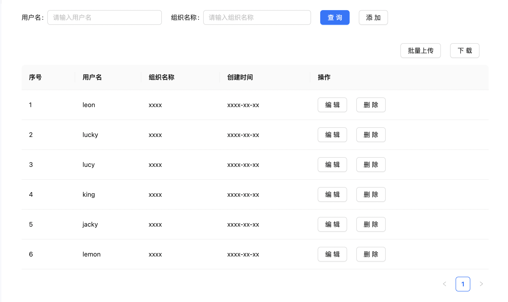

# 开发组件
开发组件是该基础框架的一大特色，为了更好的提高开发效率，我们参考低代码平台的思想，会根据常用的业务场景
去封装出不同的组件来帮助开发人员进行开发，其结果是可以让开发人员只用很少的代码就可以开发出常用的功能。

## 表单开发组件
其中，表单开发组件是以`antd UI`组件为基础封装的一款实用型组件，使用的时候只需要配置一个表单的属性对象，然后赋值给
这个表单开发组件，即可以很快地得到一个完整的表单，并且支持可扩张功能

### 基础表单

``` bash
  import React, { useState } from 'react'
  import FormLayout from 'components/formLayout'

  const Demo = () => {
    const [fdSubject, setFdSubject] = useState("")
    const [fdDesc, setFdDesc] = useState("")

    const formObj = {
      name: 'basic-form',
      layout: "horizontal",
      labelAlign: "right",
      inRow: 1,
      items: [
        {
          kind: 'input',
          type: "text",
          key: 'fdSubject',
          label: (
            <span className={classNames("form-item-label-option")}>
              <span className={classNames("form-item-require")}>*</span>
              标题
            </span>
          ),
          name: 'fdSubject',
          require,
          placeholder: '请输入标题',
          onChange: (e: any) => {
            setFdSubject(e.target.value.trim())
          }
        },
        {
          kind: 'input',
          type: "area",
          key: 'fdDesc',
          defaultValue: "0928001",
          label: (
            <span className={classNames("form-item-label-option")}>
              <span className={classNames("form-item-require")}>*</span>
              描述
            </span>
          ),
          name: 'fdDesc',
          require,
          placeholder: '请输入描述',
          onChange: (e: any) => {
            setFdDesc(e.target.value.trim())
          }
        },
      ]
    }

    return (
      <FormLayout formObj={formObj} />
    )
  }

  export default Demo
````

上面省略了部分代码，只保留了关键代码，得到的结果如下图所示：


### 可扩展表单
除了基础的表单配置属性外，表单开发组件还支持可扩张属性，比如添加相关的dom结构，下面给出示例：

``` bash
  const formObj = {
    name: 'demos-form',
    layout: 'inline',
    items: [
      {
        kind: 'input',
        key: 'username',
        value: state.username,
        label: '用户名',
        name: 'username',
        placeholder: '请输入用户名',
        callback: (e: any) => {
          setState({ ...state, username: e.target.value })
        }
      },
      {
        kind: 'input',
        key: 'group',
        value: state.group,
        label: '组织名称',
        name: 'group',
        placeholder: '请输入组织名称',
        callback: (e: any) => {
          setState({ ...state, group: e.target.value })
        }
      }
    ],
    customElements: () => (
      <section>
        <Button className={classNames("btn-action")} onClick={() => console.log("search")} type='primary'>查询</Button>
        <Button className={classNames("btn-action")} onClick={() => console.log("add")}>添加</Button>
      </section>
    )
  }
```
上面省略了部分代码，只保留了关键代码，得到的结果如下图所示：


## 列表开发组件
除了表单组件是常用的开发组件外，列表也是常用的开发组件，为此我们也对`antd`中的`table`组件进行了封装。

### 基础列表

``` bash
  import React from 'react'
  import TableLayout from 'components/tableLayout'

  const Demo = () => {
    const tabelObj = {
      columns: [
        { title: "序号", dataIndex: "sort", key: "sort" },
        { title: "用户名", dataIndex: "username", key: "username" },
        { title: "组织名称", dataIndex: "group", key: "group" },
        { title: "创建时间", dataIndex: "createAt", key: "createAt" },
        {
          title: "操作",
          dataIndex: "action",
          key: "action",
          render: (_: any, record: any) => {
            return (
              <>
                <Button className={classNames("btn-action")} onClick={() => handleDelete(record)}>删除</Button>
              </>
            )
          }
        }
      ],
      datasource: dataList,
      total: data.length,
      api: 'db/appid',
      pagination: {
        page: state.page,
        pageSize: state.pageSize,
        total: data.length
      },
      onChangePage: (page: number, pageSize: number) => onChangePagination(page, pageSize)
    }

    return (
      <TableLayout tableObj={tableObj}>
    )
  }

  export default Demo
```

通过使用封装的列表开发组件`TableLayout`，我们可以快速得到一个列表，如下图所示：


### 可扩展列表
相对应的，我们也有可扩展的列表组件来支持基础列表的功能开发，主要的用法如下：

``` bash
  import React from 'react'
  import TableLayout from 'components/tableLayout'

  const Demo = () => {
    const tabelObj = {
      columns: [
        { title: "序号", dataIndex: "sort", key: "sort" },
        { title: "用户名", dataIndex: "username", key: "username" },
        { title: "组织名称", dataIndex: "group", key: "group" },
        { title: "创建时间", dataIndex: "createAt", key: "createAt" },
        {
          title: "操作",
          dataIndex: "action",
          key: "action",
          render: (_: any, record: any) => {
            return (
              <>
                <Button className={classNames("btn-action")} onClick={() => handleDelete(record)}>删除</Button>
              </>
            )
          }
        }
      ],
      datasource: dataList,
      total: data.length,
      api: 'db/appid',
      pagination: {
        page: state.page,
        pageSize: state.pageSize,
        total: data.length
      },
      customElements: () => {
        return (
          <>
            <Button className={classNames("btn-action")}>批量上传</Button>
            <Button className={classNames("btn-action")}>下载</Button>
            <Button className={classNames("btn-action")}>查看说明</Button>
          </>
        )
      },
      onChangePage: (page: number, pageSize: number) => onChangePagination(page, pageSize)
    }

    return (
      <TableLayout tableObj={tableObj}>
    )
  }

  export default Demo
```
得到的效果如下图所示：


## 搜索页组件
当然，在传统的后台管理系统中，我们最常见的场景是上面搜索表单，下面数据呈现用的列表，为了更好的提高开发效率，我们也将这种业务场景进行了封装，实现了`searchLayout`的搜索页开发组件。

``` bash

 import React from 'react'
 import SearchLayout from 'components/searchLayout'

 const Demo = () => {
  const formObj = {
    name: 'demos-form',
    layout: 'inline',
    items: [
      {
        type: 'input',
        key: 'username',
        value: state.username,
        label: '用户名',
        name: 'username',
        placeholder: '请输入用户名',
        callback: (e: any) => {
          setState({ ...state, username: e.target.value })
        }
      },
      {
        type: 'input',
        key: 'group',
        value: state.group,
        label: '组织名称',
        name: 'group',
        placeholder: '请输入组织名称',
        callback: (e: any) => {
          setState({ ...state, group: e.target.value })
        }
      }
    ],
    customElements: () => (
      <section>
        <Button className={classNames("btn-action")} onClick={() => console.log("search")} type='primary'>查询</Button>
        <Button className={classNames("btn-action")} onClick={() => console.log("add")}>添加</Button>
      </section>
    )
  }
  
  const tabelObj = {
    columns: [
      { title: "序号", dataIndex: "sort", key: "sort" },
      { title: "用户名", dataIndex: "username", key: "username" },
      { title: "组织名称", dataIndex: "group", key: "group" },
      { title: "创建时间", dataIndex: "createAt", key: "createAt" },
      {
        title: "操作",
        dataIndex: "action",
        key: "action",
        render: (_: any, record: any) => {
          return (
            <>
              <Button className={classNames("btn-action")} onClick={() => handleUpdate(record)}>编辑</Button>
              <Button className={classNames("btn-action")} onClick={() => handleDelete(record)}>删除</Button>
            </>
          )
        }
      }
    ],
    datasource: dataList,
    total: data.length,
    api: 'db/appid',
    pagination: {
      page: state.page,
      pageSize: state.pageSize,
      total: data.length
    },
    customElements: () => {
      return (
        <>
          <Button className={classNames("btn-action")}>批量上传</Button>
          <Button className={classNames("btn-action")}>下载</Button>
        </>
      )
    },
    onChangePage: (page: number, pageSize: number) => onChangePagination(page, pageSize)
  }

  return (
    <SearchLayout formObj={formObj} tabelObj={tabelObj}>
  )
 }  

 export default Demo
```

最终我们可以很快速的得到一个搜索页面，效果如图：
