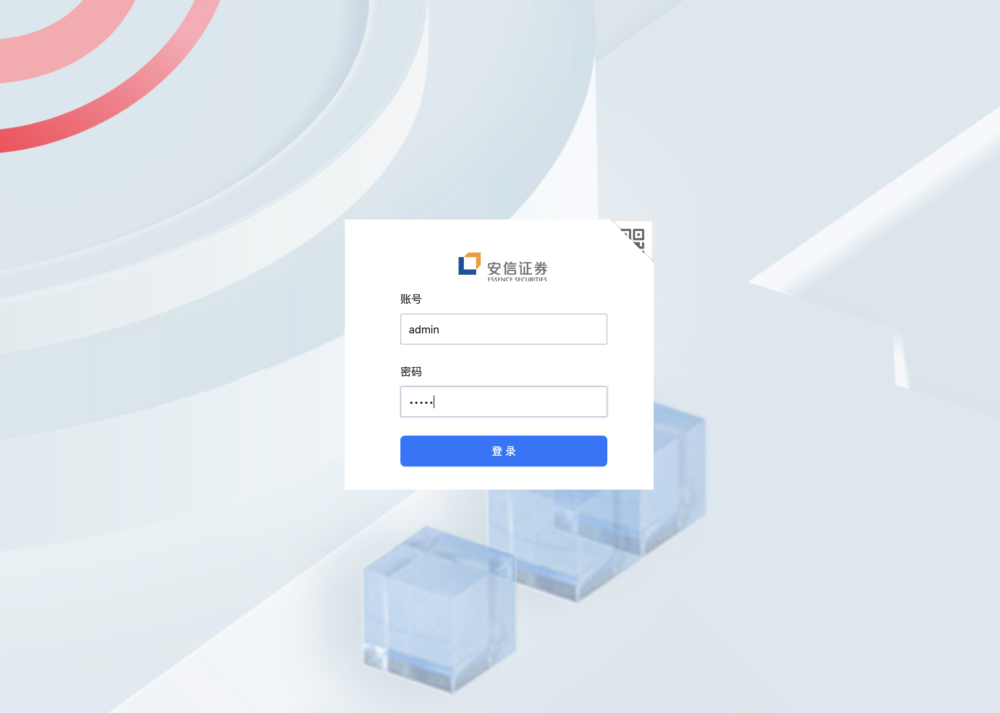
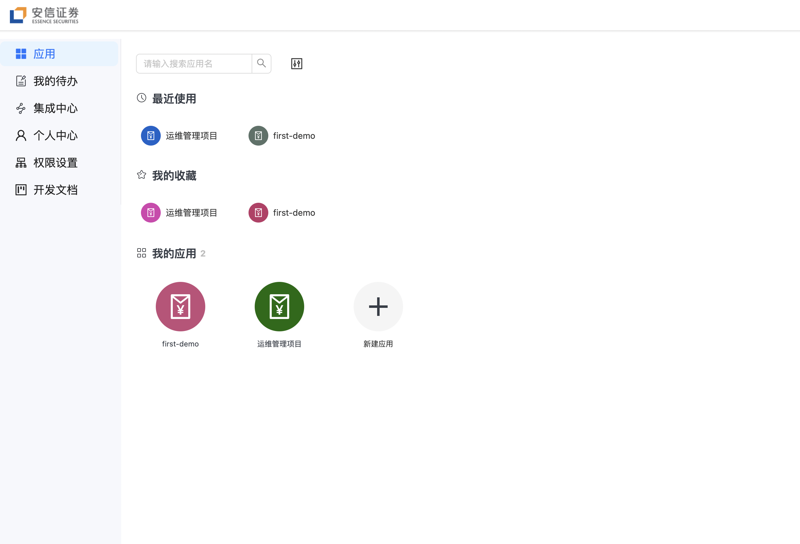
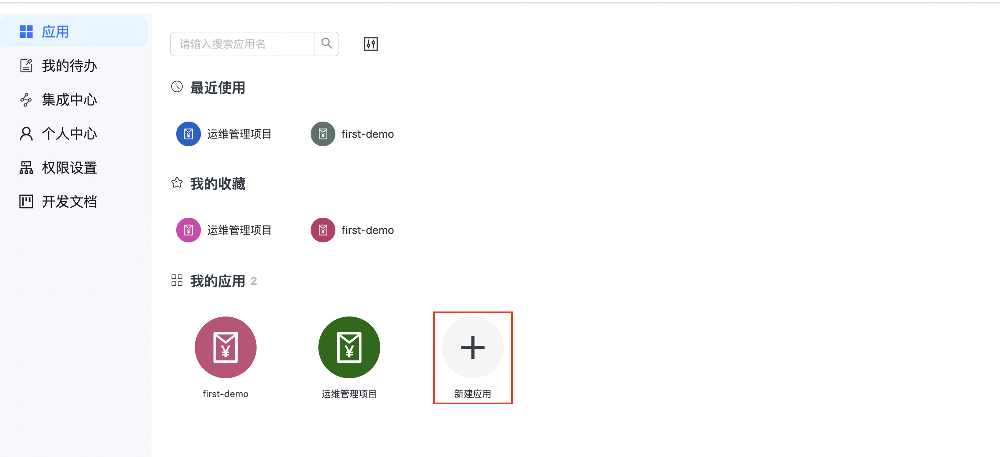
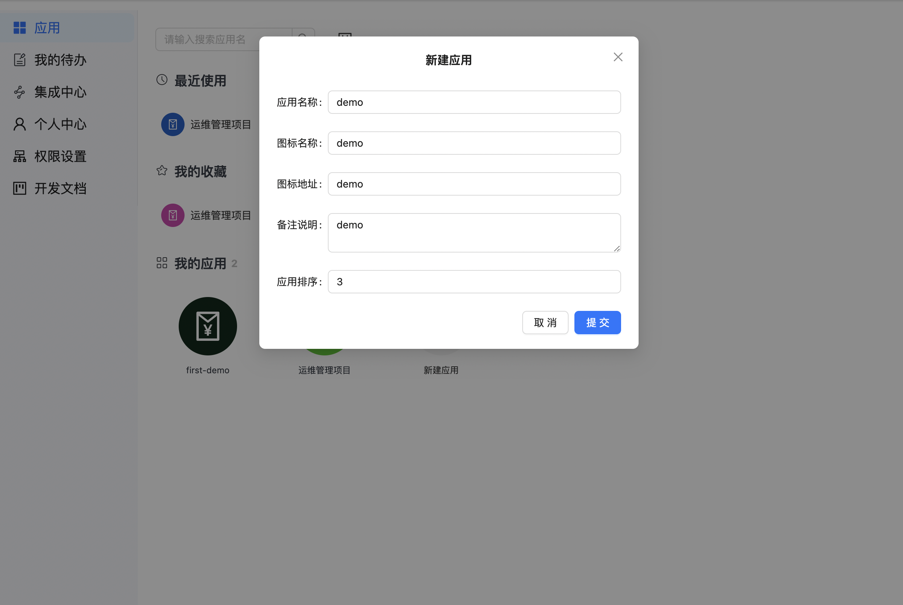
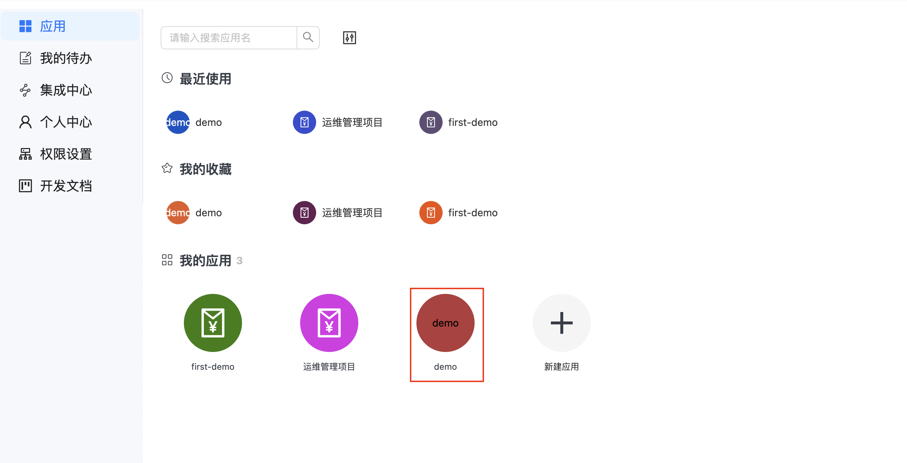
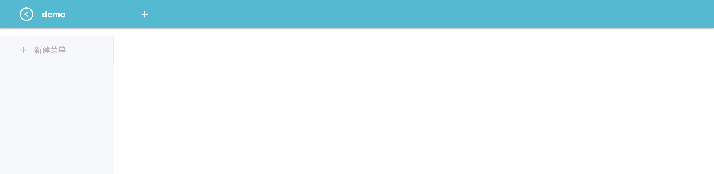
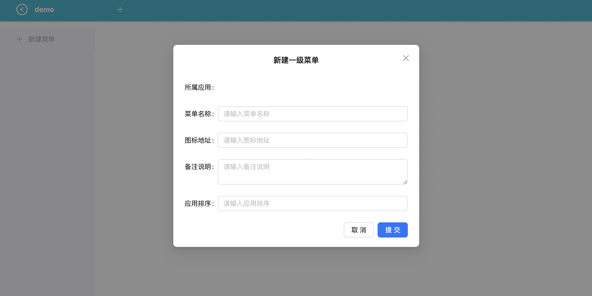
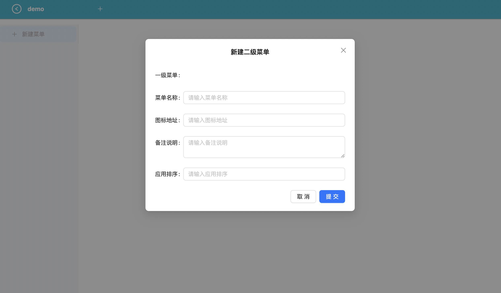
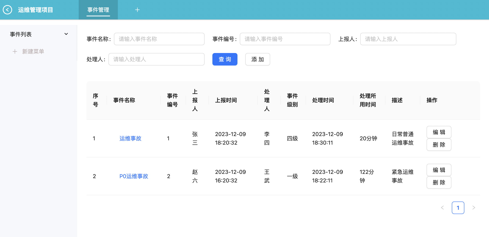
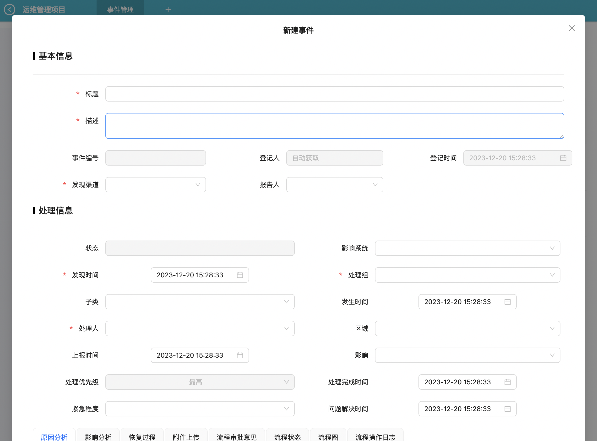

# 创建新的应用

使用该基础框架可以使用户在现有的框架基础上快速的搭建出一个具体的应用场景。  

下面以`admin`用户为例

### 登录

### 首页

在首页中，从左侧的应用菜单中我们可以看到右侧的内容，主要为应用列表。   
根据不同的状态我们可以分为：我的应用、我的收藏、最近使用模块。    
在我的应用中有一个默认的`'+'`号，点击该区域可以新建应用。

### 新建应用
点击之后，出现新建应用弹窗。

点击提交按钮之后，完成应用的创建，在应用列表中就可以看到新创建的应用`demo`了

### 应用详情
继续操作，点击demo区域，可以进入到新的页面，在这里可以开始具体业务场景的开发。

### 业务场景
从这里可以看到上方和左侧都有明显的`+`号，用来自定义添加顶部菜单和左侧菜单，点击它们则会分别弹出对应弹窗。

左侧菜单右方则是具体的业务场景部分了。

### 示例场景
在这里给出一个已经完成好的具体业务为示例：

### 小结
按照这种模式开发出具体的应用和内部的业务场景，就可以很好的利用该基础框架进行开发。